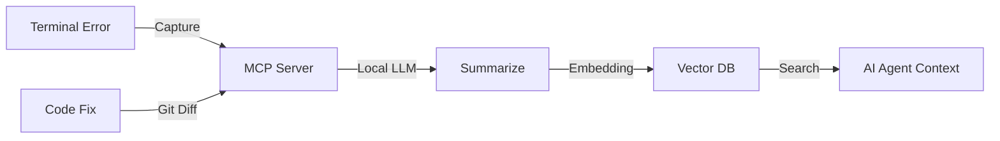

# Deja-Bug

<p align="center">
  
</p>

<h1 align="center">Deja-Bug 🐛✨</h1>

<p align="center">
  <strong>Turn your debugging sessions into AI-powered learning</strong>
</p>

<p align="center">
  Automatically capture bugs, analyze with local LLM, and build a searchable knowledge base—100% private
</p>

<p align="center">
  
  
  
  <a href="https://github.com/rasinmuhammed/deja-bug/blob/main/LICENSE"></a>
  <a href="https://github.com/rasinmuhammed/deja-bug"></a>
</p>

---

## 🎯 What Makes Deja-Bug Different?

**Traditional Logging:** You fix a bug. Tomorrow you forget how.  
**Deja-Bug:** AI analyzes your fix, stores it semantically, reminds you next time.

**🧠 Local LLM Analysis** • **🔍 Semantic Search** • **📝 Auto Reports** • **🔐 100% Private**

---

## ✨ Features

### 🎯 Core (Phase 1-2) ✅
- **🔍 Auto-detect errors** in your terminal (Python, JavaScript, TypeScript, Go, Rust)
- **📝 Smart capture** - Only saves bugs that took real debugging (>2 min), not typos
- **⏱️ Time tracking** - Know how long each bug took to fix
- **👆 Manual override** - Press `Cmd+Shift+D` to force-save any bug
- **🔗 Git integration** - Captures commit hash, diffs, and file changes

### 🧠 AI-Powered (Phase 3) ✅ **NEW!**
- **🤖 Local LLM analysis** - Powered by Ollama (qwen2.5-coder:3b)
- **📊 Root cause analysis** - AI explains what went wrong
- **💡 Key learnings** - Extracts best practices from your fixes
- **🔍 Semantic search** - Find similar bugs: "Show me null pointer issues"
- **📝 Auto-generated reports** - Beautiful markdown with insights
- **🗃️ Vector database** - LanceDB stores 768-dim embeddings for search

### 🎬 Coming Soon (Phase 4-5)
- Timeline UI with interactive bug browser
- Pattern analysis: "You often forget to check for null"
- Weekly summaries of your debugging sessions
- Export to PDF/Notion/Lineary (coming soon)

---

## 🎯 Quick Start

### Prerequisites
- Node.js 20+
- Python 3.11+
- [Ollama](https://ollama.com) for local LLMs

### Installation

1. **Install the Extension** (from VS Code Marketplace)
   ```
   Coming soon to marketplace
   ```

2. **Install Ollama Models**
   ```bash
   ollama pull qwen2.5-coder:7b
   ollama pull nomic-embed-text
   ```

3. **Start Coding**  
   That's it! Deja-Bug will start capturing errors automatically.

---

## 📖 How It Works



1. **Passive Monitoring**: Deja-Bug watches your terminal for errors (exit codes, stack traces)
2. **Fix Detection**: When you fix the code and tests pass, it captures the git diff
3. **AI Analysis**: Local LLM extracts root cause and solution
4. **Knowledge Graph**: Stores in `.deja-bug/` folder as markdown + vector embeddings
5. **Smart Retrieval**: When you hit the same error again, it suggests your past fix

---

## 🏗️ Architecture

Built on modern, production-grade foundations:

- **VS Code Extension** (TypeScript + esbuild)
- **MCP Server** (Python + fastmcp)
- **Local LLMs** (Ollama: qwen2.5-coder + nomic-embed-text)
- **Vector DB** (LanceDB for billion-scale semantic search)
- **Storage** (Markdown files + embeddings)

See [Architecture Documentation](./docs/implementation_plan.md) for deep dive.

---

## 🚀 Development

### Setup
```bash
git clone https://github.com/yourusername/deja-bug.git
cd deja-bug

# Extension setup
cd extension && pnpm install

# Server setup
cd ../server && uv sync
```

### Run Extension
- Press `F5` in VS Code to launch Extension Development Host

### Run Tests
```bash
# Extension tests
cd extension && pnpm test

# Server tests
cd server && uv run pytest
```

See [Developer Setup Guide](./docs/setup.md) for detailed instructions.

---

## 📂 Project Structure

```
deja-bug/
├── extension/          # VS Code extension (TypeScript)
├── server/             # MCP server (Python)
├── docs/               # Architecture docs + ADRs
└── .deja-bug/          # Your debugging knowledge base
    ├── bugs/           # Markdown bug reports
    └── vector.db/      # Semantic search index
```

---

## 🎓 Why Deja-Bug?

### The Problem
With AI coding assistants, developers "vibe code" faster than ever. But errors that get fixed and forgotten represent **lost learning**—for both you and your AI agent. The same bug wastes time twice.

### The Solution
Deja-Bug creates a **self-healing knowledge loop**:
- **For You**: Never debug the same issue twice
- **For Your AI**: Provide project-specific context that generic models lack
- **For Your Team**: Share tribal knowledge in `.deja-bug/` folder

---

## 🔒 Privacy

**What happens on localhost, stays on localhost.**

- ✅ All LLM inference runs locally via Ollama
- ✅ No telemetry, no external API calls
- ✅ `.deja-bug/` folder uses plain markdown (inspect/edit/delete anytime)
- ✅ Works 100% offline

---

## 🗺️ Roadmap

- [x] Phase 1: Silent error capture
- [x] Phase 2: Git diff integration
- [ ] Phase 3: Local LLM summarization (In Progress)
- [ ] Phase 4: AI agent integration
- [ ] Phase 5: Deja-Bug Wrapped (annual stats)

See [task.md](https://github.com/yourusername/deja-bug/blob/main/task.md) for detailed milestones.

---

## 🤝 Contributing

Contributions are welcome! Please read our [Contributing Guide](./CONTRIBUTING.md) first.

**Areas we'd love help with**:
- Additional error pattern detection
- Support for more languages (currently optimized for TypeScript/Python)
- UI/UX improvements
- Documentation and tutorials

---

## 📄 License

MIT License - see [LICENSE](./LICENSE) for details.

---

## 🙏 Acknowledgments

- Built on [Model Context Protocol](https://modelcontextprotocol.io) by Anthropic
- Powered by [Ollama](https://ollama.com) for local LLMs
- Uses [LanceDB](https://lancedb.com) for vector search
- Inspired by the "Spotify Wrapped" philosophy of celebrating data

---

## ⭐ Star History

If Deja-Bug helps you, consider starring the repo! It helps others discover the project.

---

## 📬 Contact

- **Issues**: [GitHub Issues](https://github.com/yourusername/deja-bug/issues)
- **Discussions**: [GitHub Discussions](https://github.com/yourusername/deja-bug/discussions)
- **Twitter**: [@yourhandle](https://twitter.com/yourhandle)

---

<p align="center">
  <strong>Turn your bugs into assets. Start using Deja-Bug today.</strong>
</p>
