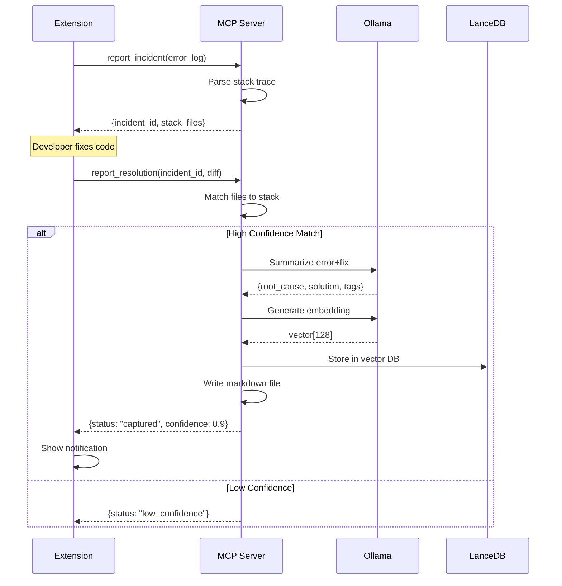

# MCP Protocol API Specification

## Overview

This document defines the MCP tools and resources exposed by the Deja-Bug server. These are called by the VS Code extension to capture, store, and retrieve debugging sessions.

---

## MCP Server Information

**Server Name**: `deja-bug`  
**Protocol Version**: MCP 1.0  
**Transport**: stdio (JSON-RPC 2.0)

---

## Tools

### 1. `report_incident`

**Description**: Called when the extension detects an error signal in the terminal.

**Parameters**:
```typescript
{
  error_log: string;        // Full terminal output (stderr)
  timestamp: number;        // Unix timestamp in ms
  terminal_id: string;      // Unique terminal identifier
  git_hash: string;         // Current commit SHA
  cwd: string;              // Working directory path
}
```

**Returns**:
```typescript
{
  incident_id: string;      // Unique ID for this incident
  stack_files: string[];    // Files extracted from stack trace
  monitoring: boolean;      // True if actively monitoring for resolution
}
```

**Example Call**:
```json
{
  "jsonrpc": "2.0",
  "method": "tools/call",
  "params": {
    "name": "report_incident",
    "arguments": {
      "error_log": "TypeError: Cannot read property 'data' of undefined\n  at handleResponse (src/api.ts:42)",
      "timestamp": 1706102400000,
      "terminal_id": "term-1",
      "git_hash": "abc123def",
      "cwd": "/Users/dev/project"
    }
  },
  "id": 1
}
```

---

### 2. `report_resolution`

**Description**: Called when terminal shows success after a previous error.

**Parameters**:
```typescript
{
  incident_id: string;      // ID from report_incident
  timestamp: number;        // Unix timestamp in ms
  git_diff: string;         // Output of git diff
  modified_files: string[]; // Paths of changed files
  exit_code: number;        // Should be 0 for success
}
```

**Returns**:
```typescript
{
  status: "captured" | "low_confidence" | "no_match";
  confidence: number;       // 0.0-1.0 match confidence
  bug_id?: string;          // Present if captured
}
```

**Example Call**:
```json
{
  "jsonrpc": "2.0",
  "method": "tools/call",
  "params": {
    "name": "report_resolution",
    "arguments": {
      "incident_id": "inc-abc123",
      "timestamp": 1706102500000,
      "git_diff": "diff --git a/src/api.ts...",
      "modified_files": ["src/api.ts"],
      "exit_code": 0
    }
  },
  "id": 2
}
```

---

### 3. `search_similar_bugs`

**Description**: Semantic search for past bugs similar to current error (RAG).

**Parameters**:
```typescript
{
  error_log: string;        // Current error to match against
  top_k?: number;           // Number of results (default: 3)
  min_similarity?: number;  // Threshold 0-1 (default: 0.7)
}
```

**Returns**:
```typescript
{
  results: Array<{
    bug_id: string;
    similarity: number;     // Cosine similarity 0-1
    root_cause: string;
    solution: string;
    tags: string[];
    file_path: string;      // Path to .md file
    created_at: number;     // Timestamp
  }>;
}
```

**Example Response**:
```json
{
  "results": [
    {
      "bug_id": "bug-xyz789",
      "similarity": 0.92,
      "root_cause": "Missing null check for API response",
      "solution": "Added optional chaining to response handler",
      "tags": ["typescript", "null-pointer", "api"],
      "file_path": ".deja-bug/bugs/2026-01-20/null-pointer-api.md",
      "created_at": 1705756800000
    }
  ]
}
```

---

### 4. `get_stats`

**Description**: Retrieve aggregated statistics for "Wrapped" feature.

**Parameters**:
```typescript
{
  start_date?: number;      // Unix timestamp (optional)
  end_date?: number;        // Unix timestamp (optional)
}
```

**Returns**:
```typescript
{
  total_bugs: number;
  resolved_bugs: number;
  top_tags: Array<{ tag: string; count: number }>;
  top_files: Array<{ file: string; count: number }>;
  avg_resolution_time_seconds: number;
  streak_days: number;      // Consecutive days with captures
}
```

---

### 5. `export_knowledge`

**Description**: Export bugs as structured data for AI training or backups.

**Parameters**:
```typescript
{
  format: "json" | "markdown" | "csv";
  include_diffs?: boolean;  // Include full git diffs
}
```

**Returns**:
```typescript
{
  export_path: string;      // Path to exported file
  bug_count: number;
  file_size_bytes: number;
}
```

---

## Resources

### 1. `bug://recent`

**URI**: `bug://recent`  
**Description**: Stream of most recent bugs (last 10)  
**MIME Type**: `application/json`

**Response**:
```json
{
  "bugs": [
    {
      "id": "bug-123",
      "created_at": 1706102400000,
      "root_cause": "...",
      "solution": "...",
      "tags": ["..."]
    }
  ]
}
```

---

### 2. `bug://{bug_id}`

**URI**: `bug://abc123`  
**Description**: Full details of a specific bug  
**MIME Type**: `text/markdown`

**Response**: Raw markdown content from `.deja-bug/bugs/{id}.md`

---

## Error Codes

| Code | Message | Meaning |
|------|---------|---------|
| `-32600` | Invalid Request | Malformed JSON-RPC |
| `-32601` | Method not found | Tool doesn't exist |
| `-32602` | Invalid params | Missing or wrong type |
| `1001` | Ollama unavailable | LLM service not running |
| `1002` | Git error | Failed to get diff |
| `1003` | Storage error | LanceDB write failure |

---

## Data Flow Sequence



---

## Extension → Server Communication

### Spawning the Server

```typescript
import { spawn } from 'child_process';

const serverProcess = spawn('uv', ['run', 'python', '-m', 'deja_bug.server'], {
  cwd: extensionContext.extensionPath + '/server',
  stdio: ['pipe', 'pipe', 'inherit']
});

// Read responses from stdout
serverProcess.stdout.on('data', (data) => {
  const lines = data.toString().split('\n');
  for (const line of lines) {
    if (line.trim()) {
      const response = JSON.parse(line);
      handleResponse(response);
    }
  }
});
```

### Sending Requests

```typescript
let requestId = 0;

function callTool(name: string, args: any): Promise<any> {
  return new Promise((resolve, reject) => {
    const id = ++requestId;
    const request = {
      jsonrpc: '2.0',
      method: 'tools/call',
      params: { name, arguments: args },
      id
    };
    
    pendingRequests.set(id, { resolve, reject });
    serverProcess.stdin.write(JSON.stringify(request) + '\n');
  });
}

// Usage
const result = await callTool('report_incident', {
  error_log: errorText,
  timestamp: Date.now(),
  terminal_id: terminal.id,
  git_hash: currentCommit,
  cwd: workspace.rootPath
});
```

---

## Testing with MCP Inspector

```bash
# Install MCP Inspector
npm install -g @modelcontextprotocol/inspector

# Run server with inspector
npx @modelcontextprotocol/inspector uv run python -m deja_bug.server
```

This opens a web UI at `http://localhost:5173` where you can:
- View available tools and their schemas
- Call tools with custom parameters
- Inspect JSON-RPC request/response payloads
- Debug protocol issues

---

## Versioning

This API follows semantic versioning. Breaking changes will increment the major version.

**Current Version**: `1.0.0`  
**Last Updated**: 2026-01-24

---

## Next Steps

- Implement these tools in `server/src/deja_bug/server.py`
- Add integration tests for each tool
- Document error handling patterns
